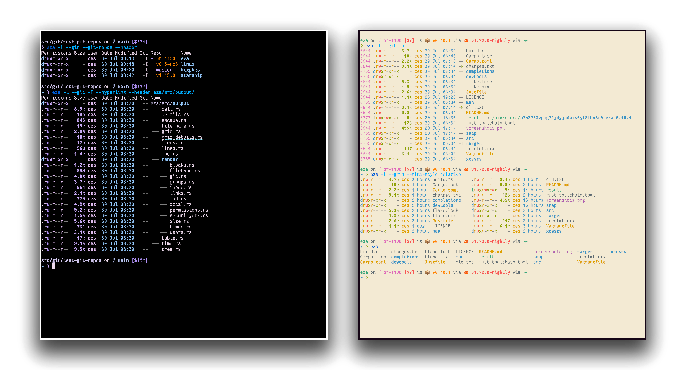

<!--
SPDX-FileCopyrightText: 2023-2024 Christina Sørensen
SPDX-FileCopyrightText: 2026 fxrdhan
SPDX-FileContributor: Christina Sørensen
SPDX-FileContributor: fxrdhan

SPDX-License-Identifier: EUPL-1.2
-->

<div align="center">
    
# lsr

**A modern, fast, and feature-rich replacement for `ls` written in Rust.**

[](LICENSE.txt)
[](https://www.rust-lang.org/)
[](https://app.cachix.org/cache/fxrdhan-lsr)

</div>



---

**`lsr`** is a fast, modern file-listing command-line tool with smart defaults, enhanced file icons, Git integration, and continuous performance improvements.

- **Fast & Lightweight:** Written in modern Rust (2024 Edition) with multithreaded directory scanning via Rayon.
- **Rich Visuals:** Syntax highlighting, colored CLI help output, Nerd Font icons, and automatic luminance color scaling.
- **Git Integration:** View file and repo status (`M`odified, `U`ntracked, `I`gnored, etc.) directly in the file listing.
- **Built-in Tree View:** Hierarchical directory tree out of the box (`lsr --tree`).
- **Structured Data Export:** Full metadata serialization via `--json` in complete parity with the long view.
- **Archive Inspection:** Inspect files inside `.tar` archives directly in the long view (`lsr -l --inspect-archives`).
- **Lines-of-Code Counter:** Comment-aware LOC breakdowns for 100+ programming languages (`lsr --code`).
- **Deep OS Integration:** Native macOS Finder color tags, Linux capability decoding (`security.capability`), and Windows `PATHEXT` executables.

---

<a id="try-it">
<h1>Try it!</h1>
</a>

### Cargo / Build from Source

Install `lsr` directly with Cargo:

```bash
cargo install --git https://github.com/fxrdhan/lsr.git
```

Or build from source:

```bash
git clone https://github.com/fxrdhan/lsr.git
cd lsr
cargo build --release
# Binary available at target/release/lsr
```

### Nix

If you already have Nix setup with flake support, you can try out `lsr` with the `nix run` command:

```bash
nix run github:fxrdhan/lsr
```

Nix will build `lsr` and run it.

If you want to pass arguments this way, use e.g. `nix run github:fxrdhan/lsr -- -la --icons`.

#### Binary Cache

Every commit on `main` is validated with `nix flake check` in CI, and the resulting store paths are pushed to a public binary cache on [Cachix](https://www.cachix.org). Contributors and Nix users can pull prebuilt outputs instead of compiling from scratch:

```bash
cachix use fxrdhan-lsr
nix run github:fxrdhan/lsr
```

**Performance & Validation:**

| Scenario | What Happens | Duration |
|---|---|---|
| **Warm Run / Downstream Users** | Full closure substituted directly from Cachix | **~33 s** *(Instant download)* |
| **Cold Build (Building from Source)** | Single-pass compilation in isolated Nix sandbox | **~7 min** |

> **Note on Caching**: Nix store paths are strictly content-addressed. Builds with modified source code produce a new derivation hash and compile inside the Nix sandbox, while unchanged closures, downstream `nix develop` environments, and CI runs on `main` enjoy the ~33 s binary substitution. A weekly cold-build canary keeps the flake honest against upstream bitrot.

---

# Installation

`lsr` is available for macOS, Linux, and Windows. Detailed platform-specific installation instructions can be found in [INSTALL.md](INSTALL.md).

---

<a id="options">
<h1>Command-line options</h1>
</a>

`lsr`’s options are intuitive and familiar. Quick overview:

## Display options

<details>
<summary>Click to expand</summary>

- **-1**, **--oneline**: display one entry per line
- **-G**, **--grid**: display entries as a grid (default)
- **-l**, **--long**: display extended details and attributes
- **-R**, **--recurse**: recurse into directories
- **-T**, **--tree**: recurse into directories as a tree
- **--code[=MODE]**: print lines-of-code summary by language (modes: `lines`, `percent`, `both`)
- **--json**: output file listing and metadata as structured JSON
- **-x**, **--across**: sort the grid across, rather than downwards
- **-F**, **--classify[=(when)]**: display type indicator by file names (always, auto, never)
- **--colo[u]r=(when)**: when to use terminal colours (always, auto, never)
- **--colo[u]r-scale=(fields)**: highlight levels of `fields` distinctly (all, age, size)
- **--color-scale-mode=(mode)**: use gradient or fixed colors in `--color-scale` (`fixed` or `gradient`)
- **--icons[=(when)]**: when to display icons (always, auto, never; requires '=' if value provided)
- **--spacing=(spaces)**: number of spaces between columns in grid views (default: 2, range: 0..=255)
- **--no-symlink-targets**: do not show symlink targets (the `-> ...`)
- **--quotes=(when)**: when to quote file names (always, auto, never; requires '=' if value provided)
- **--summary**: display total summary statistics of entries (directories, files, symlinks, and total)
- **--hyperlink[=(when)]**: when to display entries as hyperlinks (always, auto, never; requires '=' if value provided)
- **--absolute=(mode)**: display entries with their absolute path (on, follow, off)
- **--short-nix**: abbreviate Nix store hashes in file names and paths
- **--print-total**: print the total number of files and directories listed
- **--mime-types**: determine file MIME types to better inform styling decisions (unix only)
- **-w**, **--width=(columns)**: set screen width in columns (clamped to `1..65535`)

</details>

## Filtering options

<details>
<summary>Click to expand</summary>

- **-a**, **--all**: show hidden and 'dot' files (use twice to also show `.` and `..`)
- **-A**, **--almost-all**: equivalent to `--all`; included for compatibility with `ls -A`
- **--show-dotfiles**: show dot-prefixed files without showing other hidden files
- **-d**, **--treat-dirs-as-files**: list directories like regular files
- **-L**, **--level=(depth)**: limit the depth of recursion
- **-r**, **--reverse**: reverse the sort order
- **-s**, **--sort=(field)**: which field to sort by; the path field accepts the aliases `relative-path`, `relpath`, and `relative_path` (capitalised variants sort uppercase first)
- **-t**: sort by modification time, newest first (GNU `ls` compatibility; shorthand for `--sort=age`)
- **--group-directories-first**: list directories before other files
- **--group-directories-last**: list directories after other files
- **-D**, **--only-dirs**: list only directories
- **-f**, **--only-files**: list only files
- **--no-symlinks**: don't show symbolic links
- **--show-symlinks**: explicitly show links (with `--only-dirs` and `--only-files`)
- **--git-ignore**: ignore files mentioned in `.gitignore`
- **-W**, **--warn-hidden**: print a tally of hidden and gitignored entries; give twice to always print it
- **--cachedir-ignore**: ignore directories containing a `CACHEDIR.TAG` file
- **--ignore-submodule-contents**: don't list the contents of Git submodules
- **--since=(duration)**: filter and display only files created or modified within the specified duration window (e.g. 10m, 1h, 2d, 1w)
- **-I**, **--ignore-glob=(globs)**: glob patterns (pipe-separated) of files to ignore; patterns containing `/` match against paths relative to the listing root and the flag may be given multiple times
- **--ignore-glob-ci=(globs)**: glob patterns (pipe-separated) of files to ignore (case-insensitive)

</details>

## Long view options

<details>
<summary>Click to expand</summary>

These options are available when running with `--long` (`-l`):

- **-b**, **--binary**: list file sizes with binary prefixes (overrides `--bytes` if passed after)
- **-B**, **--bytes**: list file sizes in bytes, without any prefixes (overrides `--binary` if passed after)
- **-g**, **--group**: list each file’s group
- **--smart-group**: only show group if it has a different name from owner (automatically enables group column)
- **-n**, **--numeric**: show user and group as their numeric IDs
- **-h**, **--header**: add a header row to each column
- **-H**, **--links**: list each file’s number of hard links
- **-i**, **--inode**: list each file’s inode number
- **--loc[=MODE]**: display language and lines-of-code columns (modes: `lines`, `percent`, `both`)
- **-m**, **--modified**: use the modified timestamp field
- **-M**, **--mounts**: show mount details (Linux and macOS only)
- **-S**, **--blocks**, **--blocksize**: show size of allocated file system blocks
- **-t**, **--time=(field)**: which timestamp field to use (modified [aliases: mod, m], accessed [acc], changed [ch], created [cr])
- **-u**, **--accessed**: use the accessed timestamp field
- **-U**, **--created**: use the created timestamp field
- **--changed**: use the changed timestamp field
- **--utc**: show timestamps in the UTC timezone
- **-X**, **--dereference**: dereference symlinks for file information and sorting
- **-Z**, **--context**: list each file’s security context
- **-O**, **--flags**: list file flags (macOS, BSD, and Windows only)
- **-@**, **--extended**: list each file’s extended attributes and sizes
- **--no-extended**: don't show the `@` marker that a file has extended attributes
- **-e**, **--tags**: list each file's color tags stored in extended attributes (macOS Finder tags)
- **--inspect-archives**: list the contents of supported archives (.tar) in long view
- **--git**: list each file’s Git status, if tracked or ignored
- **--git-glyphs**: display Git status with Nerd Font glyphs instead of ASCII characters
- **--git-repos**: list each directory’s Git status, if tracked
- **--git-repos-no-status**: list whether a directory is a Git repository, but not its status (faster)
- **--no-git**: suppress all Git fields and `.gitignore` handling (overrides `--git`, `--git-repos`, `--git-repos-no-status`, `--git-ignore`)
- **--time-style**: how to format timestamps. Valid styles: `default`, `iso`, `long-iso`, `full-iso`, `relative`, `relative-recent`, or custom `+<FORMAT>` (e.g., `+%Y-%m-%d %H:%M`; see [_`lsr(1)` manual page_](man/lsr.1.md) and [chrono format](https://docs.rs/chrono/latest/chrono/format/strftime/index.html)).
- **--total-size**: show recursive directory size
- **-o**, **--octal-permissions**: list each file's permission in octal format
- **--no-permissions**: suppress the permissions field
- **--no-filesize**: suppress the filesize field
- **--no-user**: suppress the user field
- **--no-time**: suppress the time field
- **--stdin**: read file names from stdin

Some of the options accept parameters:

- Valid **--colo\[u\]r** options are **always**, **automatic** (or **auto** for short), and **never**.
- Valid sort fields are **accessed**, **changed**, **created**, **extension**, **Extension**, **inode**, **modified**, **name**, **Name**, **path**, **Path**, **size**, **block**, **type**, and **none**. Fields starting with a capital letter sort uppercase before lowercase. The modified field has the aliases **date**, **time**, **mod**, **old**, and **oldest**, while its reverse has the aliases **age**, **new**, and **newest**. The **block** field has the aliases **blocks** and **blocksize**.
- Valid time fields are **modified**, **changed**, **accessed**, and **created**.
- Valid time styles are **default**, **iso**, **long-iso**, **full-iso**, **relative**, and **relative-recent** (or **recent**).

See the `man` pages for further documentation of usage. They are available:
- online [in the repo](https://github.com/fxrdhan/lsr/tree/main/man)
- in your terminal via `man lsr`
</details>

## Environment Variables

<details>
<summary>Click to expand</summary>

`lsr` supports several environment variables to configure default behavior, styles, and integrations:

| Variable | Description |
|---|---|
| `LSR_COLORS` / `EZA_COLORS` / `LS_COLORS` | Specifies color styles and file extensions styling using standard terminal ANSI escape codes. |
| `LSR_CONFIG_DIR` / `EZA_CONFIG_DIR` | Custom directory containing `theme.yml` (default: `$XDG_CONFIG_HOME/lsr` or `$XDG_CONFIG_HOME/eza`). |
| `LSR_MIN_LUMINANCE` / `LSR_MAX_LUMINANCE` | Minimum and maximum luminance values (0..=100) for color scaling on dates and sizes. |
| `LSR_QUOTING_STYLE` / `EZA_QUOTING_STYLE` | Default quoting style for filenames with spaces/special characters (`always`, `auto`, `never`). |
| `LSR_ICON_SPACING` / `EZA_ICON_SPACING` | Number of spaces to insert after Nerd Font icons (default: `1`). |
| `LSR_STDIN_SEPARATOR` / `EZA_STDIN_SEPARATOR` | Delimiter for paths read from standard input with `--stdin` (default: newline `\n`). |
| `LSR_OVERRIDE_AUTO_COLOR` | Force automatic color detection behavior. |
| `TIME_STYLE` | Default timestamp format style (`default`, `iso`, `long-iso`, `full-iso`, `relative`, `relative-recent`, or `+<FORMAT>`). |
| `NO_COLOR` / `CLICOLOR` / `CLICOLOR_FORCE` | Standard terminal color control flags. |

</details>

## Custom Themes & Schema Validation

<details>
<summary>Click to expand</summary>

**`lsr`** supports a `theme.yml` file, where you can customize theme options available for the `LS_COLORS`, `EZA_COLORS`, and `LSR_COLORS` environment variables, as well as specify custom icons for different file types and extensions.

An example theme file is available in [`docs/theme.yml`](docs/theme.yml), and can be placed in a directory specified by 
`$LSR_CONFIG_DIR`, `$EZA_CONFIG_DIR`, or looked for by default in `$XDG_CONFIG_HOME/lsr` or `$XDG_CONFIG_HOME/eza`.

### Schema Validation in IDEs

You can enable autocomplete and schema validation in VSCode, Neovim, or Zed by referencing the bundled JSON Schema at the top of your `theme.yml`:

```yaml
# yaml-language-server: $schema=https://raw.githubusercontent.com/fxrdhan/lsr/main/docs/theme-schema.json

filekinds:
  directory: { foreground: Blue, bold: true }
  symlink: { foreground: Cyan }
```

Full styling details are available in the [lsr_colors-explanation(5) man page](man/lsr_colors-explanation.5.md) and [lsr_colors(5) man page](man/lsr_colors.5.md).

</details>

# Contributing to lsr

If you want to contribute to `lsr`, please check out our:
- [Code of Conduct](CODE_OF_CONDUCT.md)
- [CONTRIBUTING.md](CONTRIBUTING.md) for development guidelines.
